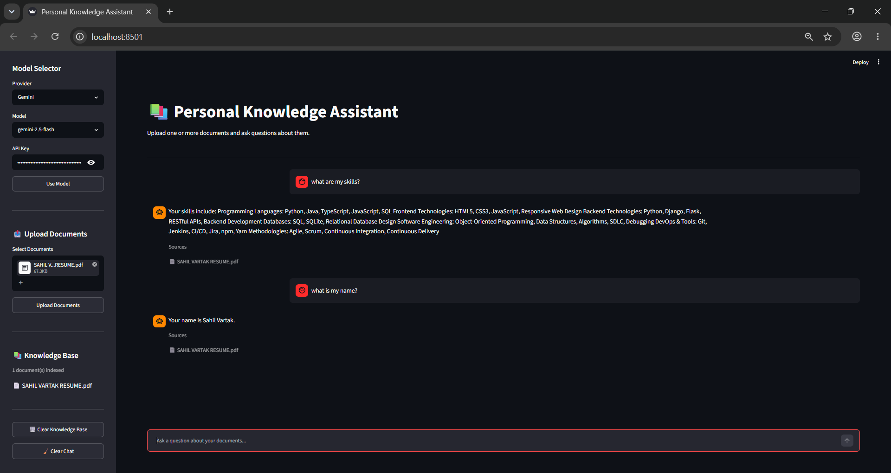
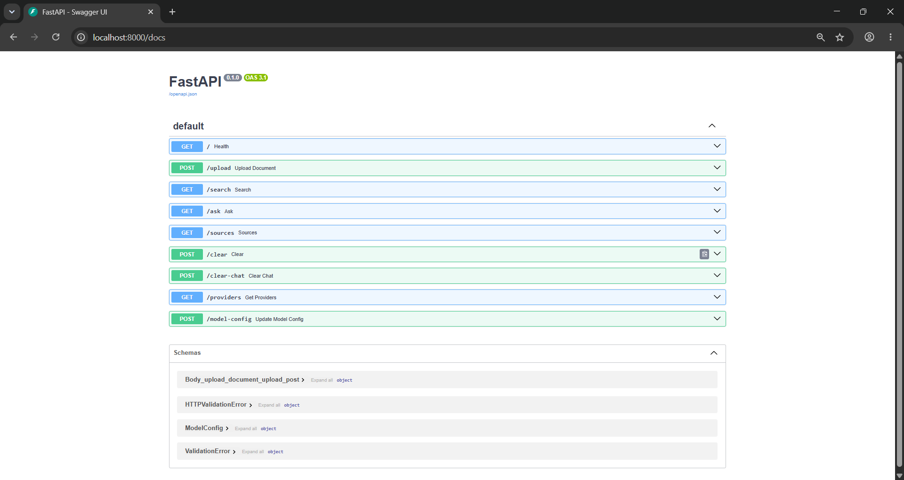

# Personal Knowledge Assistant

An AI-powered Personal Knowledge Assistant that enables users to upload documents, build a personal knowledge base, and ask questions using Retrieval-Augmented Generation (RAG).

The application retrieves relevant information from uploaded documents using semantic search and generates context-aware answers using either cloud-based or local Large Language Models (LLMs). It supports multiple AI providers, persistent vector storage, conversation history, Docker deployment, and automated CI workflows.

---

## Screenshots

### Chat Interface




### FastAPI API Documentation



---

## Architecture

```text
User
  │
  ▼
Streamlit Frontend
  │
  ▼
FastAPI Backend
  │
  ├── Document Loaders
  │     ├── PDF
  │     ├── DOCX
  │     ├── Text
  │     └── Source Code
  │
  ├── Embeddings
  │     └── all-MiniLM-L6-v2
  │
  ├── ChromaDB
  │
  └── LLM Providers
        ├── Gemini
        └── Ollama
```

---

## Features

### Document Processing

Upload and index multiple documents simultaneously.

Supported formats:

- PDF (`.pdf`)
- DOCX (`.docx`)
- TXT (`.txt`)
- Markdown (`.md`)
- Source code files:
  - Python (`.py`)
  - Java (`.java`)
  - JavaScript (`.js`)
  - TypeScript (`.ts`)
  - HTML (`.html`)
  - CSS (`.css`)
  - SQL (`.sql`)
  - C (`.c`)
  - C++ (`.cpp`)
  - C# (`.cs`)

---

### 🔍 Retrieval-Augmented Generation (RAG)

- Semantic search using Sentence Transformers embeddings
- Persistent vector storage with ChromaDB
- Context-aware response generation using retrieved document chunks
- Source attribution for generated answers
- Backend-managed conversation history

---

### Multiple AI Providers

#### Google Gemini

- Gemini 2.5 Flash
- Gemini 2.5 Pro
- Runtime API key configuration
- Graceful fallback when API keys are unavailable

#### Ollama (Local Models)

- Phi 4 Mini
- Llama 3.2 3B
- Qwen 3 4B
- Gemma 3 1B

---

### 💬 Conversation Memory

- Backend-managed chat history
- Context preserved across questions within a session
- Clear chat functionality
- Clear knowledge base functionality

---

### Web Interface

Built with Streamlit.

Features include:

- Multi-file document upload
- Dynamic model and provider selection
- Runtime API key configuration
- Knowledge base explorer
- Chat-based interface
- Source references for generated responses

---

### FastAPI Backend

Available endpoints:

```text
POST /upload
GET  /search
GET  /ask
GET  /sources
POST /clear
POST /clear-chat
GET  /providers
POST /model-config
GET  /
```

---

### Docker Support

- Containerized FastAPI backend
- Containerized Streamlit frontend
- Docker Compose orchestration
- Health checks and service dependencies
- Persistent Docker volumes for:
  - ChromaDB storage
  - Uploaded documents

---

### Development Tooling

- Ruff linting and formatting
- Pytest support
- GitHub Actions CI pipeline
- Dedicated Docker validation workflow
- Python 3.10 compatibility

---

## Tech Stack

### Backend

- FastAPI
- ChromaDB
- Sentence Transformers
- Google GenAI SDK
- Ollama
- PyPDF
- Python-Docx

### Frontend

- Streamlit

### DevOps

- Docker
- Docker Compose
- GitHub Actions
- Ruff
- Pytest

---

